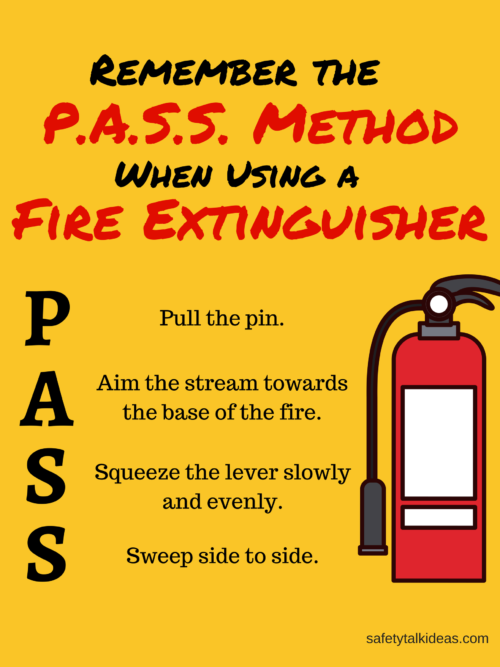

# Fire Safety Study Guide

**Name:** Manvir Singh\
**Period:** 2\
**Subject:** Public Service\
**Date:** December 9, 2024

---

## The P.A.S.S. Method (For Using a Fire Extinguisher)

1.  **P**ULL the pin.

    - This is first step after only which You will be able to use fire extinguisher.

2.  **A**IM low at the base of the fire.

    - Then aim at the base of the fire or the source of the fire to the fuel which is causing the fire

3.  **S**QUEEZE the handle.

    - So when you squeeze the handle the substance from the extinguisher will code out.

4.  **S**WEEP from side to side.
    - As you are hitting the fire sweep from left to right or side to side, so the fire gets covered with the substance to get it all out.

# Tips

- Start from 6 to 8 feet away.
- Most Fire Extinguishers are best for an average office size thrash can size fires.
- A Fire Extinguisher can last 10 to 30 seconds depending on the size of the Extinguisher.
- Fire Extinguishers include and are separated by different types of fires in categories.
